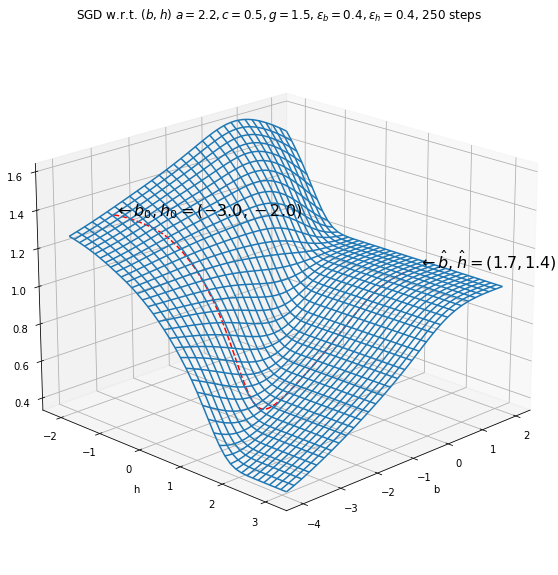
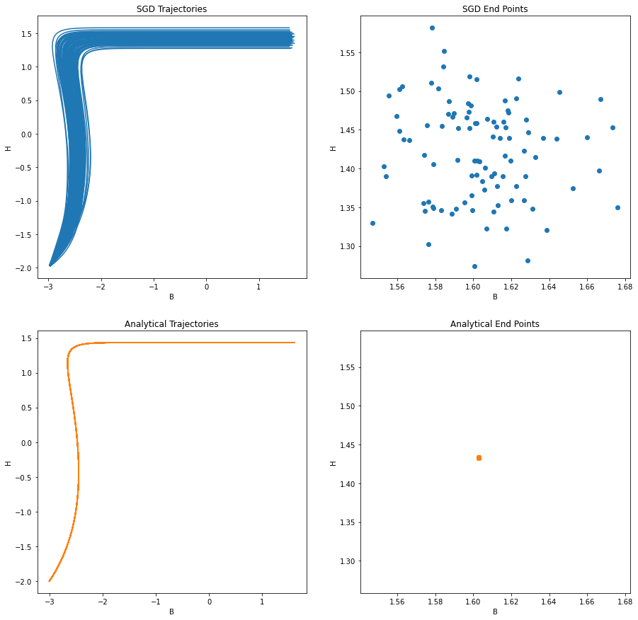
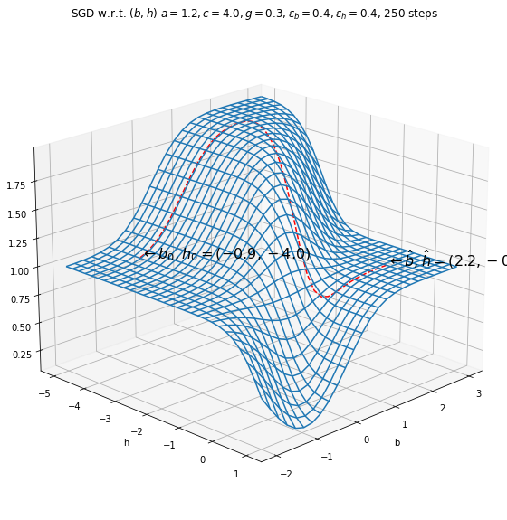
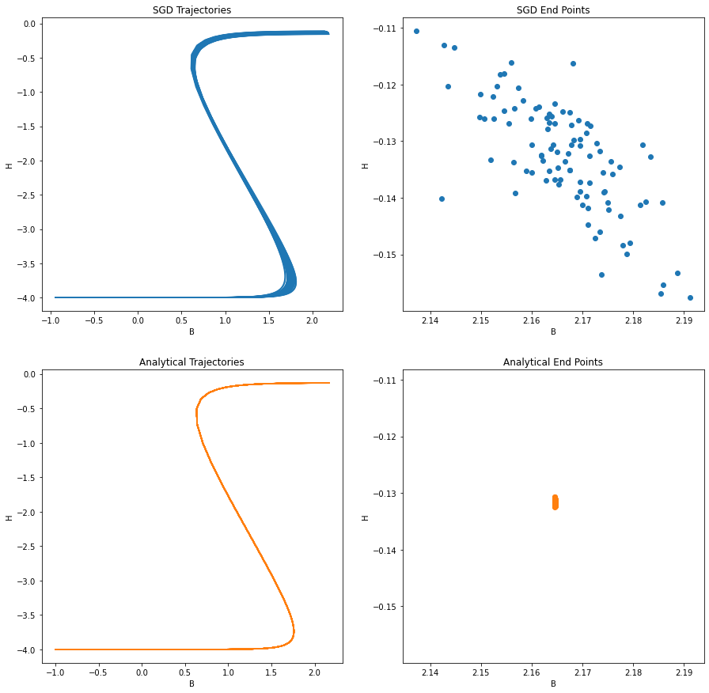

# Convergence and Optimality Analysis of Low-Dimensional Generative Adversarial Networks using Error Function Integrals

This repository contains comparative numerical simulations for the paper
__"Convergence and Optimality Analysis of Low-Dimensional Generative Adversarial Networks using Error Function Integrals"__
(authors: Graham W. Pulford, Kirill Kondrashov).
The paper is due to be published via IEEE Access in December 2021 and is available via ResearchGate in pre-print form:
https://www.researchgate.net/publication/356815736_Convergence_and_Optimality_Analysis_of_Low-Dimensional_Generative_Adversarial_Networks_using_Error_Function_Integrals

The code implements the stochastic gradient ascent / descent method (a variant of the usual SGD used for minimax optimisation) described in section V-B of the paper.
The particular use case, called Rayleigh/Square/Exponential/Erf or R/S/E/E, is based on a least-squares GAN with 1-D latent variable z and 1-D data x. The generator function is a square law of the form G(z)=gz^2+h with Rayleigh-distributed latent variable z having PDF p(z)=2z exp(-z^2). The discriminator has the form D(x)=(1+erf(ax+b))/2, where erf() is the error function. The data x are exponentially distributed with parameter c and PDF p(x)=c exp(-cx). The Rayleigh and Exponential distributions are scaled versions of the standard ones. 

Gradients for the analytical method are based on known error function integrals, and are computed via a key integral that must be evaluated numerically but that is accurate to around 3 decimal places using 1-D Monte Carlo integration with 5E+06 samples. The analytical method is described in the paper and is not present in the current repository code - the stored results for 50 realisations (of MC integration) are loaded from a file. The MC integration is the only source of randomness in the analytical method, which is otherwise deterministic. 

We provide comparisons of both analytical and MC-based computations for two special cases whose initial configuration is:
Case A: a=2.2, b=-3, g=1.5, h=-2, c=0.5; 
Case B: a=1.21, b=-1, g=0.35, h=-4, c=4.04.

In both cases, the parameters a, g and c are fixed and the optimisation is carried out over the b (discriminator) and h (generator) parameters, with ascent on b and descent on h. The analytical gradient optimisation uses a step size of 0.4.

To run the code, open the `.ipynb` file in Jupyter notebook environment. The
requirements are installed at the first executional cell. You need Python
3.x to run the code.

## Visualizations 
The graphs for the executed code are shown below. Extended comments
on them can be found in the article.

Case A: Single SDG run.

Case A: comparison between analytical and MC results.

Case B: Single SDG run.

Case B: comparison between analytical and MC results.

